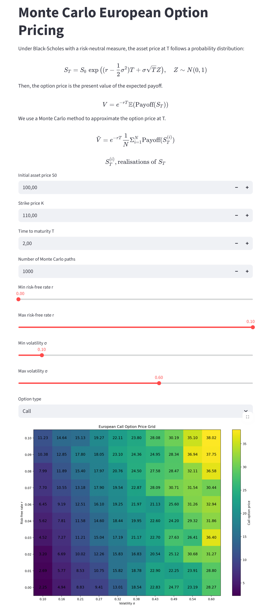

# Monte Carlo European Option Pricing

This Streamlit app visualizes European call and put option prices using a Monte Carlo simulation. I also added a grid with prices computed with closed form Black-Scholes solution to have a ground truth comparison.

Dependencies: Streamlit, NumPy, Matplotlib, Scipy.

## Usage
To use this repository:

Clone or download the repository to your local machine.

Ensure you have the necessary dependencies installed:
```bash
pip install -r reqs.txt
```

Run the following command in your terminal:
```bash
streamlit run option_pricing.py
```
- Use the **sliders** to select different parameters:  
  - Risk-free interest rate `r`  
  - Volatility `σ`  
  - Initial asset price `S₀`  
  - Strike price `K`  
- Choose between a **call** or **put** option.  
- Define the **number of Monte Carlo iterations** to control the approximation accuracy.

The app then computes and displays a **grid showing the estimated option price** for different values of `(r, σ)`. Each cell of the grid shows the **Monte Carlo estimated premium** of the selected option type.

## Example


# Simple-Option-pricing-method-via-Monte-Carlo
